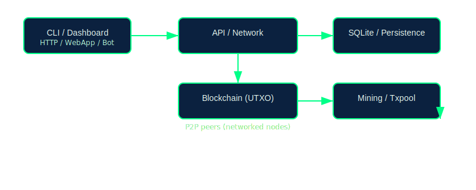

# TrinityChain

A triangle-first blockchain: value is represented as geometric triangles (area = value). Built with Rust and focused on research, performance, and an experimental take on UTXO economics.

--

**Status (Honest):** This repository has been maintained primarily by one human developer with the assistance of AI tooling. The project is functional, includes tests, and compiles — but it needs more human contributors: developers, reviewers, designers, and testers. If you like building novel systems, we'd love your help.

## Quick overview

- Triangle-based UTXO model
- Proof-of-Work (SHA-256) with difficulty adjustments
- Rust codebase with modular components (network, mining, persistence, API)
- Developer-friendly: tests, CLI tools, and a web dashboard

## Architecture (high-level)





## Why we need contributors

This project started as the work of a single developer (with AI assistance). That means:

- Many features are drafts or minimal implementations.
- Tests exist, but more coverage and stress-testing are needed.
- The network, UX, and security layers would benefit greatly from review and real-world testing.

If you can code, review, design, test, or write docs — please join. Small PRs, issue triage, or running a local node are all valuable.

## Get started (contribute in small steps)

1. Fork & clone this repo

```bash
git clone https://github.com/TrinityChain/TrinityChain.git
cd TrinityChain
```

2. Build and run tests

```bash
cargo build --release
cargo test
```

3. Run a local node (quick):

```bash
# Start a node on port 3030 (example)
cargo run --bin trinity-node -- 3030
```

4. Try the miner CLI (fast single-block mine):

```bash
cargo run --bin trinity-mine-block -- <your_beneficiary_address>
# or use parallel mining
cargo run --bin trinity-mine-block -- --threads 4 <your_beneficiary_address>
```

5. Create a small PR

- Look for `good first issue` label (or open one describing a small task)
- Submit changes to a branch and open a PR. We review quickly.

## Where to help (examples)


 
2. Create a branch: `git checkout -b feature/your-name`
3. Write tests for your changes
4. Run `cargo test` and ensure all pass
5. Commit, push, and open a PR with a short description

We accept small, incremental PRs — documentation and tests are especially welcome.

## Quick Links

- Repo: https://github.com/TrinityChain/TrinityChain
- Issues: https://github.com/TrinityChain/TrinityChain/issues
- Dashboard: `dashboard/` (see `dashboard/README.md`)

---

Thank you — and welcome to help build TrinityChain!
